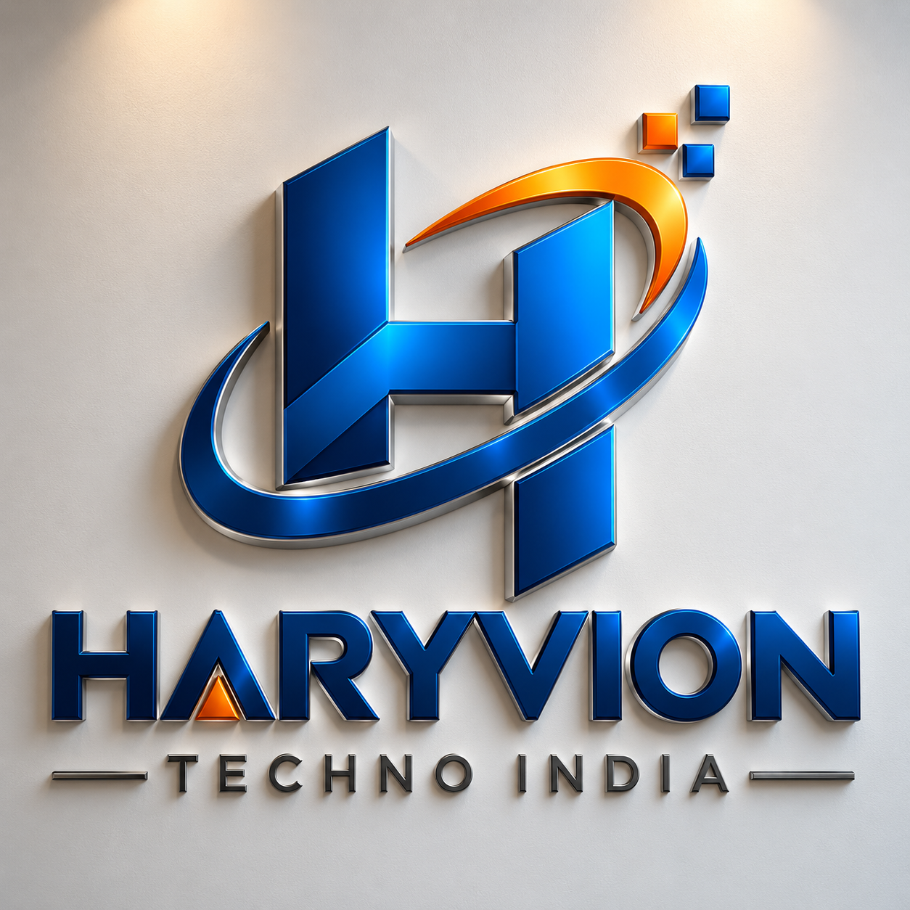

Haryvion Technology India - IT Solutions Website

  

  

    <strong>Modern, responsive React website for Haryvion Technology India</strong>
  

  

    Building reliable digital solutions for modern businesses
  

  

    <a href="#features">Features</a> •
    <a href="#tech-stack">Tech Stack</a> •
    <a href="#getting-started">Getting Started</a> •
    <a href="#project-structure">Project Structure</a> •
    <a href="#customization">Customization</a> •
    <a href="#deployment">Deployment</a>
  

Table of Contents

About

Features

Services

Tech Stack

Getting Started

Prerequisites

Installation

Usage

Project Structure

Customization

Available Scripts

Deployment

Contact

License

About

Haryvion Technology India is an IT solutions and software development company established in 2025.

This website is built with a modern React-based frontend to present the company's services, portfolio, capabilities, team, testimonials, and contact information in a professional and responsive experience.

The website is designed for businesses looking for dependable technology solutions, modern web experiences, mobile applications, custom software, and ongoing IT support.

Features

Modern Professional Design - Clean and business-focused interface

Fully Responsive - Optimized for desktop, tablet, and mobile devices

Fast Performance - Built with Vite and optimized React components

Smooth Animations - Interactive transitions powered by Framer Motion

SEO Ready - Semantic structure and configurable metadata

Tailwind CSS - Flexible utility-first styling

TypeScript - Type-safe development

Reusable Components - Modular and maintainable component architecture

Multiple Pages - Home, About, Services, Portfolio, Team, Contact, Terms, and more

Portfolio Showcase - Present completed projects and business solutions

Testimonials - Showcase client feedback and project outcomes

Responsive Navigation - Desktop mega menu and mobile navigation

Contact CTA Sections - Clear paths for potential clients to reach the team

Indian Pricing - Service/project budget ranges can be presented in INR

Mobile-Friendly Contact Actions - Direct phone and email actions

Services

Haryvion Technology India focuses on practical technology solutions, including:

Web Development

Website Development

Mobile Application Development

Custom Software Development

UI/UX Implementation

Business Applications

IT Consulting

Software Maintenance

Technical Support

Testing and Deployment

Digital Transformation Solutions

Tech Stack

React 18 - Frontend library

TypeScript - Type-safe JavaScript development

Vite - Frontend build tool and development server

Tailwind CSS - Utility-first CSS framework

Framer Motion - Animations and transitions

React Router - Client-side routing

Lucide React - Icon library

Lottie React - Vector animations

ESLint - Code quality and linting

Getting Started

Prerequisites

Before you begin, make sure you have:

Node.js 16 or higher

npm, yarn, or pnpm

Git

Installation

Clone the repository

git clone <your-repository-url>
cd haryvion-technology-india

Install dependencies

npm install

Or:

yarn install

Or:

pnpm install

Start the development server

npm run dev

Open the website

Vite will display the local development URL in the terminal. Open that URL in your browser.

Usage

After starting the development server, you can edit the React components inside src/. Vite will automatically reload the application during development.

Main Pages

Page

Route

Home

/

About

/about

Services

/services

Portfolio

/portfolio

Team

/team

Contact

/contact

Terms

/terms

Make sure the routes above match the routes configured in src/App.tsx.

Project Structure

haryvion-technology-india/
├── public/
│   ├── HARYVIONTECHNO.png
│   ├── bg1.JPG
│   ├── bg2.JPG
│   ├── bg3.JPG
│   └── ...                  # Other static assets
│
├── src/
│   ├── components/          # Reusable UI components
│   │   ├── Navbar.tsx
│   │   ├── Footer.tsx
│   │   ├── Hero.tsx
│   │   ├── Testimonials.tsx
│   │   └── ...
│   │
│   ├── pages/               # Application pages
│   │   ├── Index.tsx
│   │   ├── About.tsx
│   │   ├── Services.tsx
│   │   ├── Portfolio.tsx
│   │   ├── Team.tsx
│   │   ├── Contact.tsx
│   │   └── ...
│   │
│   ├── hooks/               # Custom React hooks
│   ├── lib/                 # Utilities and helpers
│   ├── App.tsx              # Application routes
│   ├── main.tsx             # Application entry point
│   └── index.css            # Global styles
│
├── index.html
├── package.json
├── tailwind.config.ts
├── vite.config.ts
└── tsconfig.json

Customization

Logo & Branding

The primary company branding is:

Haryvion Technology India

Company started in:

2025

Main contact email:

haryviontechnologyindia@gmail.com

Phone:

+91 98765 43210

Update the logo and brand assets inside the public/ directory as required.

Images

Place website images inside:

public/

Example:

public/HARYVIONTECHNO.png
public/bg1.JPG
public/bg2.JPG
public/bg3.JPG

Reference them in React with:

Colors

The website uses a professional blue/white visual direction. Tailwind colors can be customized through:

tailwind.config.ts

Example:

export default {
  theme: {
    extend: {
      colors: {
        brand: {
          primary: "#2563eb",
          dark: "#1e3a8a",
        },
      },
    },
  },
};

Content

Update website text in:

src/components/
src/pages/

When replacing placeholder content, use real company information, actual project details, and verified team/client information.

SEO

Update:

index.html

for:

Page title

Meta description

Open Graph metadata

Favicon

Social sharing metadata

Available Scripts

npm run dev

Starts the development server.

npm run build

Creates the production build.

npm run build:dev

Creates a development-mode build if configured in package.json.

npm run preview

Previews the production build locally.

npm run lint

Runs ESLint and checks the project for code-quality issues.

Production Build

Before deployment, run:

npm run build

The optimized production files will be generated in:

dist/

Test the production build locally with:

npm run preview

Deployment

Vercel

Push the project to GitHub.

Import the repository into Vercel.

Use the standard Vite build configuration.

Deploy the project.

Netlify

Push the project to GitHub.

Connect the repository to Netlify.

Build command:

npm run build

Publish directory:

dist

GitHub Pages

Build the application:

npm run build

Then deploy the generated dist/ directory according to your GitHub Pages configuration.

For React Router applications, configure the hosting provider to serve index.html as the fallback for client-side routes.

Contact

Haryvion Technology India

📧 Email: haryviontechnologyindia@gmail.com

📞 Phone: +91 98765 43210

Started: 2025

For project enquiries, software development requirements, IT consulting, or support, use the website contact page or the contact details above.

Contributing

If this repository is being developed as an internal company project, keep changes organized and review them before production deployment.

For an open-source version, contributions can follow the standard workflow:

Fork the project.

Create a feature branch.

Make your changes.

Test the application.

Commit your changes.

Push the branch.

Open a pull request.

License

Add the project's applicable license in the LICENSE file.

If this project uses the MIT License, the repository may include the standard MIT License text and attribution requirements.

Acknowledgments

This website uses open-source technologies including:

React

TypeScript

Vite

Tailwind CSS

Framer Motion

React Router

Lucide React

Lottie React

<strong>Haryvion Technology India</strong>

  
Building reliable digital solutions since 2025.

  
© 2025 Haryvion Technology India. All rights reserved.

